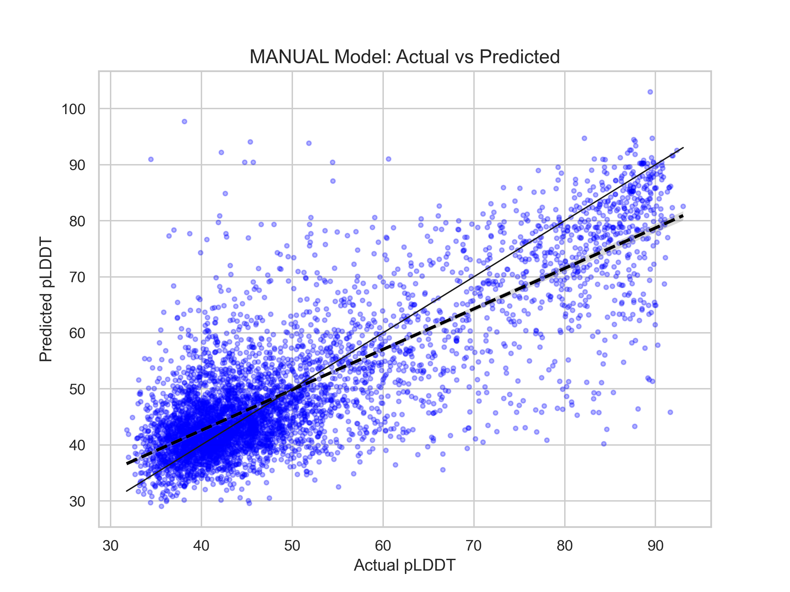
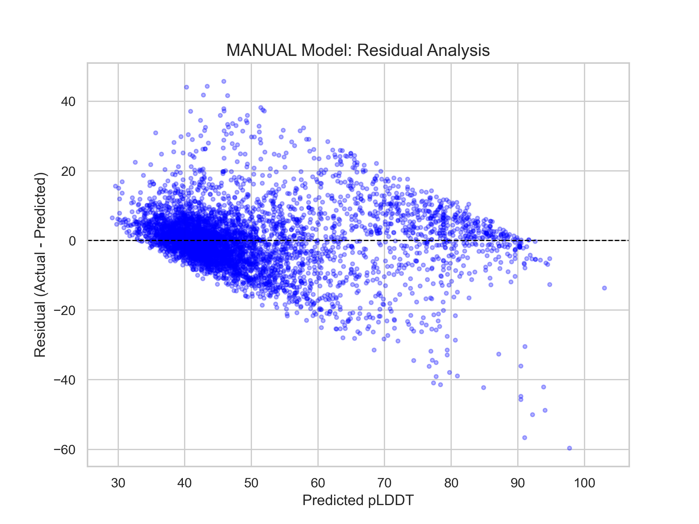
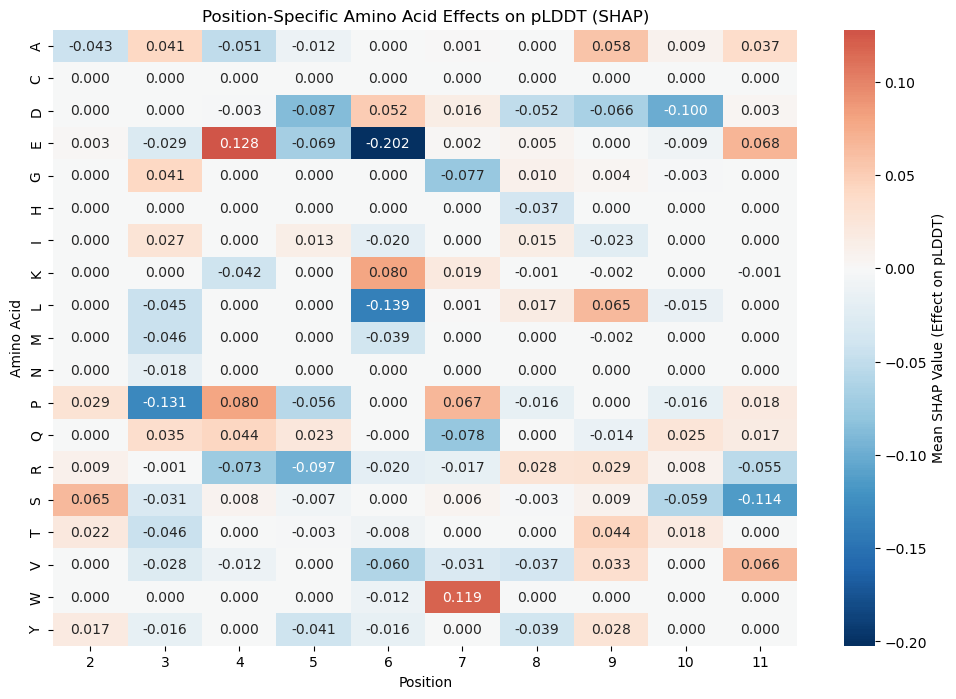

# Peptide pLDDT Predictor - Machine Learning Pipeline

This repository contains a professional-grade Deep Learning pipeline for predicting peptide pLDDT scores using PyTorch. The model migrates from a traditional linear regression approach to a Multi-Layer Perceptron (MLP) architecture, incorporating advanced optimization, interpretability, and diagnostic tools.

## Key Features

- **Deep Learning Framework**: Built with **PyTorch**, optimized for Apple Silicon (MPS/GPU).
- **Advanced Optimization**: Utilizes **Bayesian Optimization (Optuna)** for hyperparameter tuning and **GroupKFold** cross-validation for robust performance estimation.
- **Interpretability**: Integrated **SHAP (Shapley Additive Explanations)** to visualize position-specific amino acid effects on pLDDT.
- **Professional Diagnostics**: Complete suite for residual analysis, bias detection, and identifying biochemical "blind spots."
- **Experiment Tracking**: Integrated with **Weights & Biases (W&B)** for real-time training monitoring.

## Project Structure

- `src/`: Core logic and feature engineering.
  - `data_loader.py`: Loading CSV datasets, sequence alignment, and feature encoding.
  - `esm_feature_extractor.py`: Interface for ESM-2 embeddings.
- `scripts/`: Independent pipelines for training and analysis.
  - `train_pytorch.py`: Main training script for the MLP model.
  - `hyperparameter_tune_advanced.py`: Bayesian hyperparameter tuning with Optuna.
  - `plot_diagnostics_pytorch.py`: Evaluation metrics and residual analysis.
- `streamlit_app.py`: Interactive Streamlit dashboard for real-time prediction and exploration.
- `assets/docs/`: Visual assets used in this documentation.

## Model Performance & Diagnostics

### 1. Reliability Analysis
The model demonstrates strong predictive power, as visualized in the Correlation and Residual plots.

| Actual vs Predicted | Residual Analysis |
| :---: | :---: |
|  |  |

### 2. SHAP Interpretability
The 2D SHAP heatmap reveals exactly which amino acids at specific positions drive the pLDDT score higher or lower.



### 3. Biological Blind Spots
We identify specific sequences where the model deviates most from the actual values, pointing to rare biochemical motifs for further investigation.

| Sequence | Actual pLDDT | Predicted | Residual |
| :--- | :---: | :---: | :---: |
| `GESTRQNFPG-----` | 24.52 | 84.26 | -59.74 |
| `SVPQRDIFSS----` | 33.32 | 87.36 | -54.04 |
| `-ELAELDEQRN` | 40.54 | 93.23 | -52.69 |
| `-SLERQIFLDA` | 42.66 | 90.75 | -48.09 |
| `-KDNLSQQIES` | 91.24 | 46.35 | 44.89 |

## How to Run

1. **Install Dependencies**:
   ```bash
   pip install -r requirements.txt
   ```

2. **Run the Dashboard**:
   ```bash
   streamlit run streamlit_app.py
   ```

3. **Run Training (from root)**:
   ```bash
   python scripts/train_pytorch.py
   ```

4. **Run Advanced Tuning**:
   ```bash
   python scripts/hyperparameter_tune_advanced.py
   ```

## Next Steps
- Implement **ESM-2 Embeddings** for enhanced biological context.
- Explore **1D-CNN** architectures for local motif detection.
- Use the model as a "Digital Lab" for generative peptide design.
